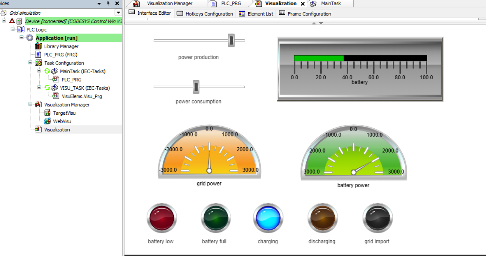
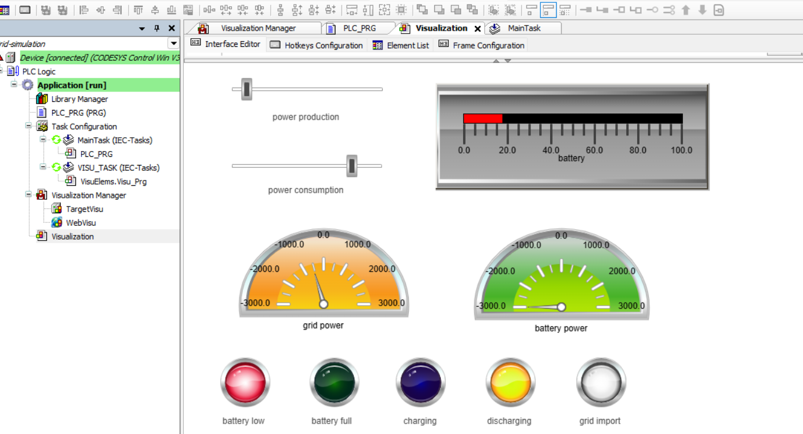

🔋 Basic Home Energy Management - PLC Simulation

A simple Structured Text (ST) PLC program developed in CODESYS to simulate a residential solar power system with battery storage. This project was created as a proof-of-concept to practice PLC programming and basic energy balancing logic.

🎯 Project Overview

The simulation manages the energy flow between three components:

Solar Power Production (Simulated via manual input)

Home Power Consumption (Simulated via manual input)

Virtual Battery Energy Storage System (BESS)

The logic simply calculates the current power balance and determines whether to charge the battery, discharge it, or exchange power with the electrical grid.

📊 Simulation Examples

Here is how the basic logic reacts under different simulated load conditions:

☀️ Example 1: Excess Solar (Battery Charging)

When Solar Production > Home Consumption, the surplus energy is routed to the battery up to its maximum charge limit. Any remaining power is exported to the grid.

🌙 Example 2: High Demand (Battery Discharging)

When Home Consumption > Solar Production, the battery discharges to cover the deficit. If the demand exceeds the battery's maximum discharge rate or capacity, the remaining power is drawn from the grid.

⚙️ How It Works (Code Features)

The project uses standard PLC concepts to simulate the physical behavior of the system:

Structured Text (ST): Written according to the IEC 61131-3 standard.

Standard Naming: Variables use common prefixes (r for REAL, x for BOOL).

Energy Integration: Converts Power (W) to Energy (Wh) using the task cycle time (rDeltaTimeHours).

Power Limiting: Uses MIN and MAX functions to ensure the battery doesn't charge or discharge faster than its allowed physical limits.

Capacity Limits: Basic IF statements prevent the State of Charge (SoC) from exceeding 100% or dropping below 0%.

UI Deadbands: A simple 1.0W threshold is used for the HMI status LEDs to prevent rapid flickering around zero.

🖥️ HMI Visualization

The project includes a basic CODESYS WebVisu screen featuring:

Sliders to manually adjust solar production and home load.

Gauges displaying Grid Power flow and Battery Power flow.

A horizontal bar graph indicating the current State of Charge (SoC).

Simple state indicators (LEDs) for Battery Low, Battery Full, Charging, Discharging, and Grid Import statuses.

🚀 Future Possibilities

While currently just a software simulation, this basic logic could serve as a starting point for running on physical PLC hardware (e.g., a Raspberry Pi with CODESYS runtime) and reading data from real hardware sensors via protocols like Modbus TCP.
